# Suds & Shine mobile design exploration

Captured from the current Compose Multiplatform Android build on an API 35 emulator after the splash update in commit `8157ddc`. The concepts are directional UI references, not production-ready image assets.

## Current app

| Launch | Home | Booking |
| --- | --- | --- |
| 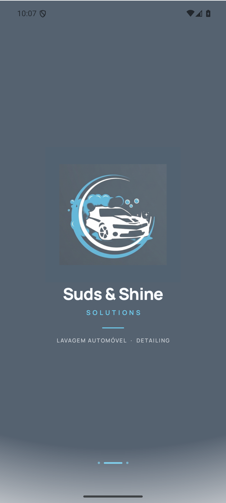 | 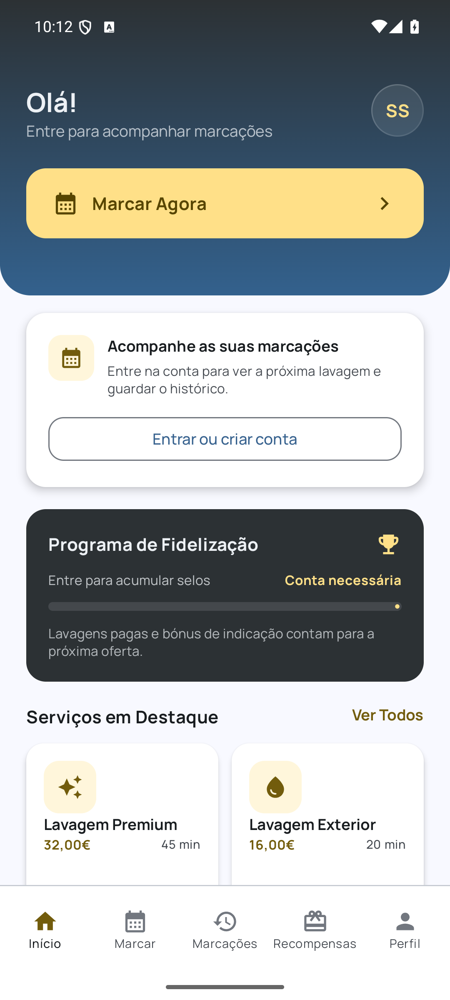 | 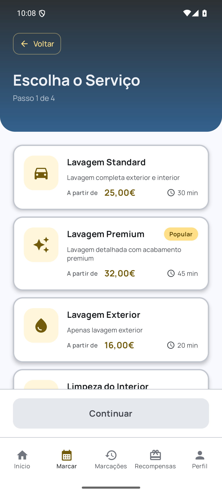 |

Additional captures: [native Android launch](current/01-android-native-launch.png), [bookings](current/05-bookings.png), [rewards](current/06-rewards.png), [profile](current/07-profile.png), and [home after scrolling](current/08-home-scrolled.png).

## What is holding the design back

- The oversized navy header consumes roughly one quarter of most screens but stops providing context after scrolling.
- Most content uses the same white rounded-card treatment, so actions, information, and empty states compete at the same visual weight.
- The muted gold reads muddy beside the clearer cyan in the brand mark. Cyan should become the primary action and motion colour; champagne should be a small premium accent.
- Five equal-width labelled tabs make the bottom navigation crowded. Booking is the primary task and should be a distinct central action, leaving four persistent destinations.
- The booking list has useful information but weak selection feedback and a large disabled footer. A sticky selection summary makes the next action obvious.
- Android still exposes a white native launch frame before the Compose splash. The native Android launch theme should be brought into the same navy brand system as the iOS and Compose screens.

## Proposed direction

| Modern home | Modern booking |
| --- | --- |
| 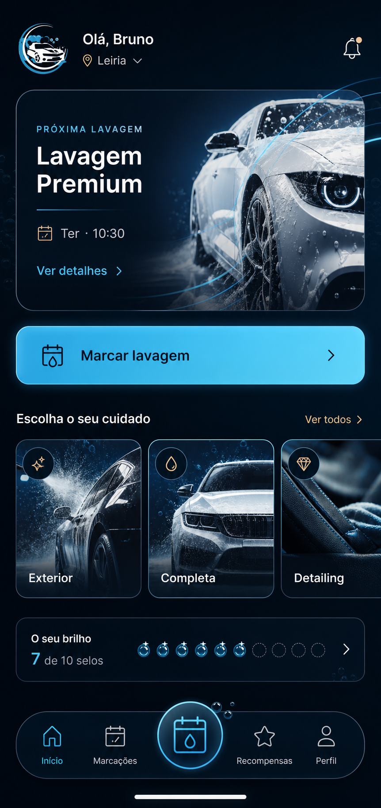 | 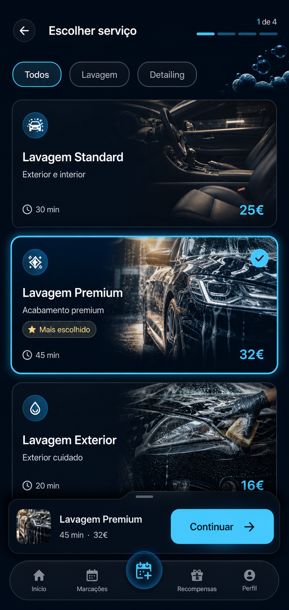 |

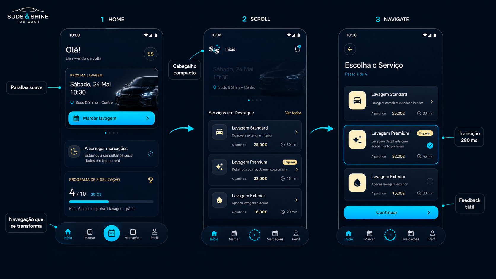

The direction keeps the existing logo and navy/cyan equity, but gives the product a premium automotive-detailing character: dark glass surfaces, car-body highlight curves, restrained foam geometry, stronger editorial type, and fewer—but more meaningful—containers.

The detailed, ticket-by-ticket delivery plan is in [IMPLEMENTATION_PLAN.md](IMPLEMENTATION_PLAN.md).

## Implemented baseline

The exploration has now been implemented across the customer journey. The final Android reference captures and release-hardening evidence are in [final/README.md](final/README.md).

| Native launch | Home | Booking |
| --- | --- | --- |
| 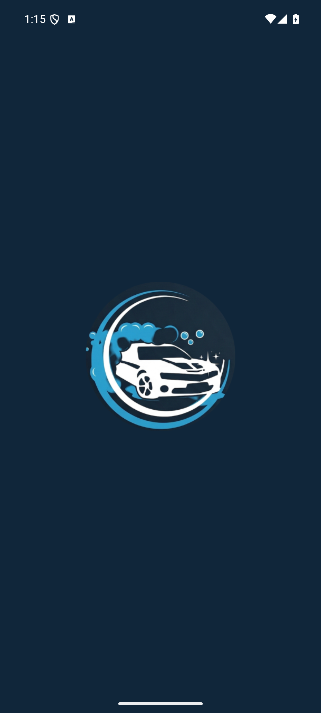 | 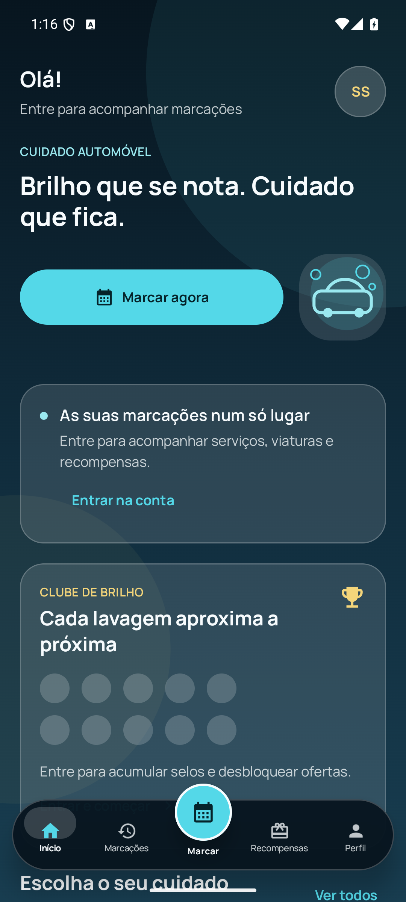 | 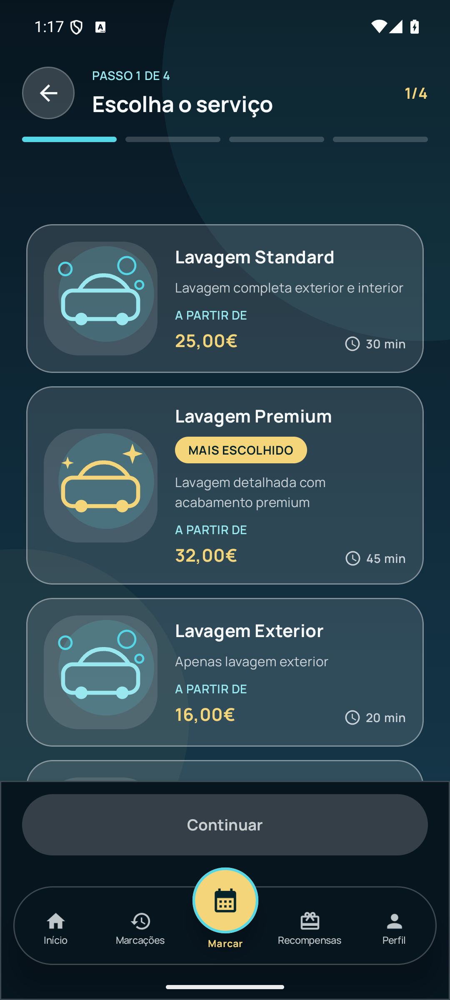 |

| Services | Rewards | Profile |
| --- | --- | --- |
| 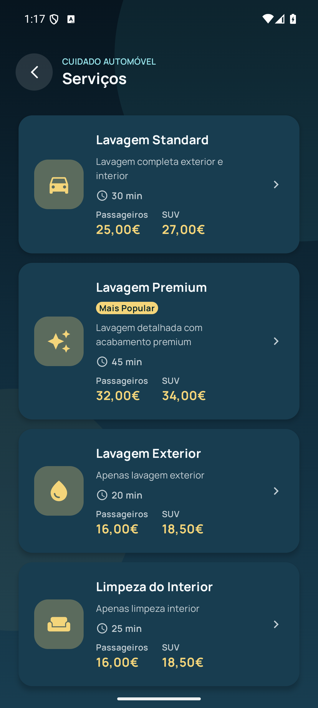 | 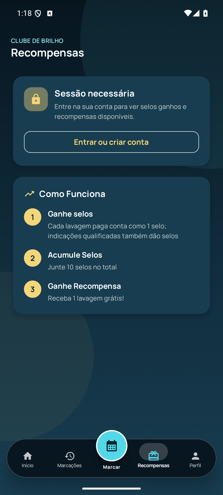 | 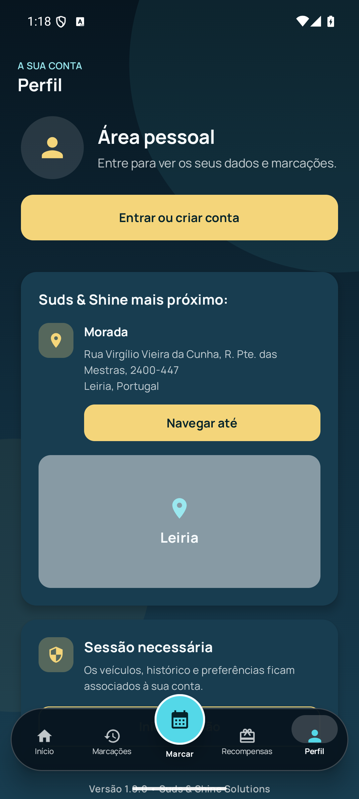 |

## Motion and navigation specification

- **Scroll:** move the hero artwork at about `0.35x` content speed while fading it from `1.0` to `0.72`. Collapse the greeting into a 64 dp sticky bar; do not animate body text continuously.
- **Screen transitions:** use a shared-axis horizontal slide plus fade for peer destinations, `280 ms` with a fast-out-slow-in curve. Booking steps move only forward/backward along the same axis.
- **Navigation:** four persistent destinations—Início, Marcações, Recompensas, Perfil—with a raised central booking action. The selected icon uses a short spring scale (`0.92 → 1.0`) and the capsule indicator moves rather than crossfading.
- **Booking morph:** when the central action is pressed, morph its calendar/drop icon into the four-segment booking progress indicator before the content settles.
- **Feedback:** one light haptic on destination change, service selection, and booking-step completion. Respect reduced-motion settings by replacing parallax and shared-axis motion with short fades.
- **Performance:** animate transforms and alpha, not layout size on every scroll frame. Keep photography clipped to stable bounds and pre-size remote images.

## Suggested implementation slices

1. Introduce the updated colour, surface, type, shape, and motion tokens in the shared design system.
2. Replace the bottom bar and wire animated destination transitions without changing routes.
3. Rebuild Home with a collapsing header, appointment hero, service rail, and compact loyalty module.
4. Rebuild booking selection with filters, strong selected state, and a sticky summary action.
5. Apply the system to bookings, rewards, profile, auth, onboarding, and empty/error states.

## Generation record

Mode: built-in image generation, reference-guided UI mockups using the captured app screens.

### Modern home prompt

```text
High-fidelity portrait mobile UI redesign for Suds & Shine, a Portuguese premium car wash and detailing service. Preserve the deep ink navy, electric cyan, and existing car-and-foam brand mark; use champagne only as a small premium accent. Create a signed-in home with a compact greeting and location, next-appointment hero, Marcar lavagem CTA, horizontal service collection, bubble-based loyalty progress, and a floating capsule navigation with four destinations and a raised central booking action. Make it distinctive, accessible, Compose-ready, and avoid generic fintech gradients or repetitive white cards.
```

### Modern booking prompt

```text
High-fidelity portrait mobile booking UI for Suds & Shine. Create service selection step 1 of 4 with a compact sticky header, segmented progress, category chips, cinematic service cards for Lavagem Standard, Lavagem Premium, and Lavagem Exterior, a clearly selected Premium state, a sticky selection summary with Continuar, and the same floating capsule navigation. Use the navy/cyan automotive-detailing system, accurate Portuguese copy, accessible contrast, and buildable Compose proportions.
```

### Motion storyboard prompt

```text
Wide 16:9 product-design motion storyboard for Suds & Shine showing three portrait frames: Home at the top, Home after scroll with gentle hero parallax and a collapsed sticky header, and booking after pressing the raised central action. Show the navigation morph, shared-axis transition, selected service feedback, curved cyan motion arrows, and concise callouts for Parallax suave, Cabeçalho compacto, Navegação que se transforma, Transição 280 ms, and Feedback tátil. Keep it premium, restrained, and Compose Multiplatform-ready.
```
